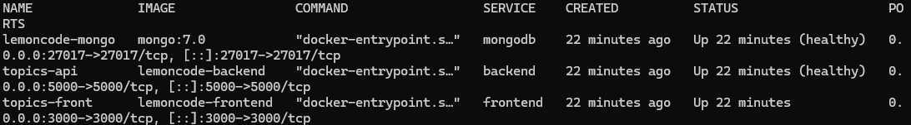
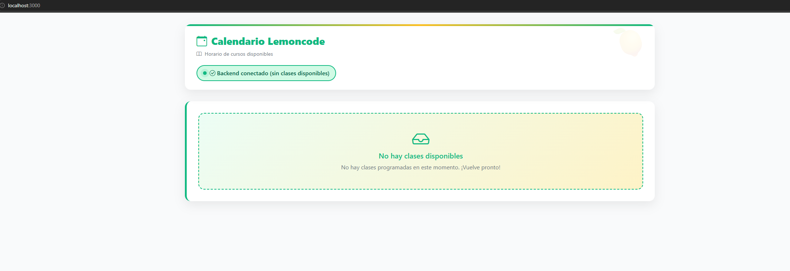

# Solución — Laboratorio de Contenedores (Lemoncode)

Esta carpeta contiene la solución de los 4 retos del laboratorio de contenedores,
basada en el stack de **Node.js** (`../node-stack`).

```
solution/
├── README.md            ← esta guía
├── images/              ← capturas de la solución
├── reto1.sh             ← MongoDB en Docker + backend en local
├── reto2.sh             ← Backend dockerizado
├── reto3.sh             ← Frontend dockerizado
├── reto4.sh             ← Orquestación con Docker Compose
├── crud-check.sh        ← Verificación CRUD reutilizable
├── backend.Dockerfile   ← Imagen del backend
├── frontend.Dockerfile  ← Imagen del frontend
├── compose.yml          ← Pila completa (Reto 4)
└── .env.example         ← Variables de entorno de referencia
```

---

## Stack elegido

Se ha utilizado el stack de **Node.js** (`node-stack`), concretamente:

- **Backend**: `node-stack/backend` — Express + MongoDB. Escucha en el puerto `5000`,
  API en `/api/classes`, colección `Classes`, base de datos `ClassesDb`.
- **Frontend**: `node-stack/frontend` — Express + EJS que renderiza en servidor un
  calendario (FullCalendar). Escucha en el puerto `3000`.
- **Base de datos**: MongoDB.

Motivo de la elección: el backend Node usa `npm` con `package-lock.json` (instalación
determinista con `npm ci`), no requiere paso de compilación y sus variables de entorno
(`DATABASE_URL`, `DATABASE_NAME`, `HOST`, `PORT`, `API_URL`) permiten configurar la
conexión sin tocar el código fuente. El stack `.NET` (`dotnet-stack`) **no se ha
modificado** y queda intacto para quien prefiera usarlo.

---

## Requisitos

- **Docker** (con el demonio en marcha) y el plugin **`docker compose`** (v2).
- Para el **Reto 1** (backend en local) además se necesita **Node.js 18/20/22** y
  **npm** instalados en la máquina, porque el backend se ejecuta fuera de Docker.
- `curl` para las verificaciones automáticas (presente en casi cualquier sistema).

> ℹ️ Los scripts `reto2.sh`–`reto4.sh` se apoyan en `reto1.sh` para garantizar los
> prerrequisitos, por lo que se pueden ejecutar en orden o de forma aislada.

---

## Reto 1 — MongoDB en contenedor

`reto1.sh` crea la infraestructura necesaria para que el backend Node.js corra en
local y se conecte a un MongoDB dockerizado.

### Qué hace `reto1.sh`

1. Verifica que Docker está disponible y el demonio responde.
2. Crea la red Docker `lemoncode-network` si no existe.
3. Crea el volumen con nombre `lemoncode-mongo-data` (persistencia).
4. Arranca MongoDB (`mongo:7.0`) en el contenedor `lemoncode-mongo`, publicado en
   el puerto `27017`, con el volumen montado en `/data/db`.
5. Espera a que MongoDB esté realmente listo (ping con `mongosh`).
6. Muestra la configuración para arrancar el backend en local.

### Ejecución

```bash
cd 01-contenedores/lemoncode-challenge/solution
./reto1.sh            # arranca/verifica MongoDB
./reto1.sh --debug    # con trazas detalladas
./reto1.sh --down     # detiene MongoDB (conserva el volumen)
```

### Comandos manuales equivalentes

```bash
docker network create \
  --label com.docker.compose.project=solution \
  --label com.docker.compose.network=lemoncode-network \
  lemoncode-network
docker volume create lemoncode-mongo-data
docker run -d \
  --name lemoncode-mongo \
  --network lemoncode-network \
  -p 27017:27017 \
  -v lemoncode-mongo-data:/data/db \
  mongo:7.0
```

### Persistencia de MongoDB

Los datos se guardan en el volumen con nombre `lemoncode-mongo-data`. Parar y
reiniciar el contenedor (o ejecutar `reto1.sh --down` y luego `reto1.sh`) **no
borra los datos**. El volumen solo se elimina explícitamente con
`docker volume rm lemoncode-mongo-data` o con `docker compose down -v` en el Reto 4.

### Configuración del backend en local

El backend lee estas variables de entorno (`app.js`):

| Variable       | Por defecto                  | Valor para el Reto 1        |
|----------------|------------------------------|-----------------------------|
| `DATABASE_URL` | `mongodb://localhost:27017`  | `mongodb://localhost:27017` |
| `DATABASE_NAME`| `ClassesDb`                  | `ClassesDb`                 |
| `HOST`         | `0.0.0.0`                    | (por defecto)               |
| `PORT`         | `5000`                       | (por defecto)               |

Como MongoDB se publica en `localhost:27017`, el valor por defecto de
`DATABASE_URL` ya funciona sin configuración extra.

### Arrancar el backend en local

```bash
cd 01-contenedores/lemoncode-challenge/node-stack/backend
npm install
DATABASE_URL=mongodb://localhost:27017 \
DATABASE_NAME=ClassesDb \
npm start
```

La API queda en `http://localhost:5000/api/classes`.

### Verificación con REST Client (`backend/client.http`)

El archivo `node-stack/backend/client.http` define peticiones de ejemplo. Con la
extensión **REST Client** de VS Code:

1. Abre `node-stack/backend/client.http`.
2. `@host` está en `http://localhost:5001`; ajústalo a `http://localhost:5000` si
   tu backend escucha en 5000 (puerto por defecto de `app.js`).
3. Ejecuta `GET /api/classes`, luego los `POST` para crear clases, y de nuevo
   `GET` para verlas.

### Inspeccionar los datos de MongoDB

- **MongoDB Compass**: conéctate a `mongodb://localhost:27017`, base `ClassesDb`,
  colección `Classes`.
- **MongoDB for VS Code**: misma conexión.
- **Línea de comandos**:

```bash
docker exec -it lemoncode-mongo mongosh ClassesDb --eval 'db.Classes.find().pretty()'
```

---

## Reto 2 — Dockerizar el backend

`reto2.sh` construye la imagen del backend y la arranca en la red Docker,
conectándose a MongoDB por DNS de Docker.

### Dockerfile

`solution/backend.Dockerfile` — imagen `node:20-slim`, instala dependencias con
`npm ci --omit=dev` (determinista, respeta `package-lock.json`), copia `app.js`,
corre como usuario no-root `node`. No usa multi-stage porque la app no tiene paso
de compilación (un solo stage es más eficiente).

### Comandos

```bash
cd 01-contenedores/lemoncode-challenge/solution

# Build
docker build -f backend.Dockerfile -t lemoncode-backend ../node-stack/backend

# Run
docker run -d \
  --name topics-api \
  --network lemoncode-network \
  -p 5000:5000 \
  -e DATABASE_URL=mongodb://lemoncode-mongo:27017 \
  -e DATABASE_NAME=ClassesDb \
  -e HOST=0.0.0.0 \
  -e PORT=5000 \
  lemoncode-backend

# O con el script (garantiza MongoDB primero)
./reto2.sh
./reto2.sh --test   # ejecuta además la verificación CRUD
./reto2.sh --down   # detiene solo el backend
```

### Configuración de red y conexión a MongoDB

- El contenedor se une a `lemoncode-network`.
- Se conecta a MongoDB usando **DNS de Docker**: `mongodb://lemoncode-mongo:27017`
  (el hostname `lemoncode-mongo` resuelve dentro de la red; **no** se usa `localhost`).
- Puerto publicado: `5000`.

### URL del backend

```
http://localhost:5000/api/classes
```

### Verificación REST Client

Igual que en el Reto 1, usando `backend/client.http` con `@host = http://localhost:5000`.
El script `reto2.sh --test` automatiza una verificación CRUD completa (crear, leer,
actualizar, borrar) mediante `crud-check.sh`.

---

## Reto 3 — Dockerizar el frontend

`reto3.sh` construye la imagen del frontend y la arranca en la red Docker.

### Dockerfile

`solution/frontend.Dockerfile` — imagen `node:20-slim`, `npm ci --omit=dev`,
copia `server.js` y `views/`, corre como usuario no-root `node`.

### Comandos

```bash
cd 01-contenedores/lemoncode-challenge/solution

# Build
docker build -f frontend.Dockerfile -t lemoncode-frontend ../node-stack/frontend

# Run
docker run -d \
  --name topics-front \
  --network lemoncode-network \
  -p 3000:3000 \
  -e API_URL=http://topics-api:5000/api/classes \
  lemoncode-frontend

# O con el script (garantiza backend primero)
./reto3.sh
./reto3.sh --down   # detiene solo el frontend
```

### Conexión frontend ↔ backend y distinción Docker DNS vs navegador

Este es el punto clave del Reto 3. El frontend **no** hace peticiones desde el
navegador: `server.js` usa `node-fetch` en el **servidor** para obtener las clases
y luego renderiza la plantilla EJS con los datos ya embebidos (`<%- JSON.stringify(classes) %>`).

Por tanto, `API_URL=http://topics-api:5000/api/classes` funciona porque **la
resolución del hostname `topics-api` ocurre dentro del contenedor del frontend**
(pertenece a `lemoncode-network` y resuelve por DNS de Docker), **no** en el
navegador del host. El navegador del host solo se conecta a `localhost:3000` y
recibe HTML ya renderizado.

Esto evita la necesidad de nginx o de un proxy inverso: el propio servidor Express
del frontend actúa como intermediario.

### URL del navegador

```
http://localhost:3000
```

---

## Reto 4 — Docker Compose

La pila completa se orquesta con `solution/compose.yml`, que define:

- **`mongodb`** (`mongo:7.0`) con healthcheck (`mongosh ping`), volumen
  `lemoncode-mongo-data`, puerto `27017`.
- **`backend`** (construye `backend.Dockerfile`) con healthcheck (GET
  `/api/classes` → 200), depende de `mongodb` (`condition: service_healthy`),
  puerto `5000`, variables de entorno de conexión.
- **`frontend`** (construye `frontend.Dockerfile`), depende de `backend`
  (`condition: service_healthy`), puerto `3000`, `API_URL` apuntando al backend
  por DNS de Docker.
- Red `lemoncode-network` y volumen `lemoncode-mongo-data`, ambos con nombre
  explícito.

### Uso

Desde `01-contenedores/lemoncode-challenge/solution/`:

```bash
# Levantar todo (construye las imágenes si hace falta)
docker compose up --build

# En segundo plano
docker compose up --build -d

# Ver estado de los servicios
docker compose ps

# Ver logs
docker compose logs
docker compose logs -f

# Detener la pila CONSERVANDO el volumen de MongoDB
docker compose down

# Detener la pila Y ELIMINAR el volumen (borra los datos de MongoDB)
docker compose down -v
```

> ⚠️ **`docker compose down`** conserva el volumen `lemoncode-mongo-data`: los
> datos de MongoDB persisten entre arranques. **`docker compose down -v`**
> elimina también ese volumen, borrando todos los datos.

El script `reto4.sh` envuelve el arranque y la validación, pero el uso directo de
`docker compose` sigue siendo totalmente válido:

```bash
./reto4.sh            # levanta y valida todo
./reto4.sh --down     # detiene (conserva volumen)
./reto4.sh --down -v  # detiene y borra el volumen
```

---

## Debug mode

Todos los scripts aceptan `--debug` para mostrar trazas de diagnóstico detalladas
(comandos que se ejecutan, estados intermedios, conteos). La salida normal es
deliberadamente concisa.

```bash
./reto1.sh --debug
./reto2.sh --debug
./reto3.sh --debug
./reto4.sh --debug
```

Los scripts de parada aceptan `--down` (y `-v` en `reto4.sh`). El modo `--help`
muestra el resumen de uso.

---

## Validación

Validación ejecutada el 24 de agosto de 2026 con Docker Desktop:

- **Sintaxis Bash**: `bash -n` sin errores para los cuatro scripts y `crud-check.sh`.
- **Compose**: `docker compose config` válido, las imágenes construyen y
  `docker compose up --build -d` levanta MongoDB, backend y frontend sin advertencias.
- **CRUD**: `crud-check.sh` verificó crear, recuperar, actualizar, borrar y obtener
  `404` tras el borrado contra la API contenida.
- **Integración**: una clase temporal creada en `localhost:5000` se renderizó en
  `http://localhost:3000`, confirmando la comunicación frontend → backend.
- **Persistencia**: la misma clase sobrevivió a `docker compose down` seguido de
  `docker compose up --build -d`; el volumen no se eliminó y el dato temporal se limpió.

En un entorno con Docker, ejecutar `./reto4.sh` desde `solution/` debe levantar
y validar toda la pila completa (MongoDB + backend + frontend) y realizar la
verificación CRUD automáticamente.

---

## Capturas

Las siguientes capturas documentan la ejecución de la solución:

### Servicios de Docker Compose

`docker compose ps` muestra MongoDB y el backend saludables, junto con el
frontend publicado en el puerto 3000.



### Aplicación en el navegador

La aplicación está disponible en `http://localhost:3000` y confirma la conexión
con el backend.


