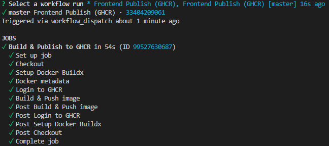
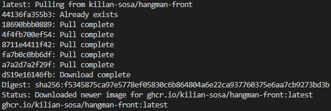

# Solucion de Continuous Delivery

Esta entrega usa la pista de **Jenkins** y completa A3 como ejercicio opcional
de GitHub Actions. A4 tambien esta implementado, aunque no se valida mediante
evento remoto porque GitHub Issues esta deshabilitado. No implementa la pista
de GitLab.

## Matriz de entrega

| Ejercicio | Implementacion | Estado de validacion |
| --- | --- | --- |
| J1: pipeline Gradle declarativa | `jenkins-resources/Jenkinsfile` con Checkout, Compile y Unit Tests | Pipeline from SCM ejecutada correctamente en `*/feat/cd-exercises-solution` |
| J2: Jenkins con DinD | `solution/jenkins/` | Compose, plugins, TLS y montaje del workspace Jenkins -> DinD validados con la Pipeline real |
| A1: CI frontend | `.github/workflows/hangman-front-ci.yml` | Build y test locales validados con Node 24; ejecucion remota de la PR #3 correcta |
| A2: GHCR manual | `.github/workflows/hangman-front-publish.yml` | `workflow_dispatch` ejecutado correctamente en `master`; imagen construida y publicada en GHCR |
| A3: E2E | `.github/workflows/hangman-e2e.yml` | API, frontend y los dos specs Cypress suministrados validados localmente y en la PR #3 |
| A4: accion `motivate` (opcional) | `.github/actions/motivate/` y workflow | Accion y rutas de cita/fallback validadas localmente; no se ejecuto `issues:labeled` porque GitHub Issues esta deshabilitado en este repositorio. A3 ya satisface el opcional requerido |

Las aplicaciones de trabajo estan en `hangman-front/`, `hangman-api/` y
`hangman-e2e/`. Son copias de `.start-code`.

## Jenkins

`03-cd/exercises/jenkins-resources/Jenkinsfile` es una Pipeline Declarative.
Hace `checkout scm` y ejecuta `./gradlew compileJava` y `./gradlew test` desde
`03-cd/exercises/jenkins-resources/calculator` mediante el agente Docker exacto
`gradle:7.6.6-jdk17`.

La configuracion DinD usa un daemon `docker:24.0.7-dind` separado, privilegiado
y con TLS. Jenkins lleva Docker CLI y los plugins `docker-plugin` y
`docker-workflow`; se conecta al alias TLS `docker:2376`. No monta el socket
Docker del host. Vease `jenkins/README.md`.

## GitHub Actions

- La CI se dispara solo con `pull_request` que cambie `hangman-front/**`, usa
  Node 24, `npm ci`, `npm run build` y `npm test`, con `contents: read`.
- El workflow de GHCR se dispara solo con `workflow_dispatch`, usa
  `contents: read` y `packages: write`, y publica
  `ghcr.io/kilian-sosa/hangman-front`. Se ejecuto correctamente sobre `master`,
  autenticando en GHCR y publicando la imagen. El nombre es estatico y en
  minusculas: no depende de que `github.repository_owner` ya venga normalizado.
- El E2E crea las imagenes, arranca API en `3001:3000` y frontend en
  `8080:8080`, espera respuestas HTTP, ejecuta `npx cypress run` y limpia
  siempre contenedores y red.
- `motivate-issue.yml` escucha `issues:labeled` y exige que la etiqueta anadida
  sea exactamente `motivate`. La accion JavaScript usa Node 24, registra el
  mensaje y tiene fallback local si falla type.fit. Es un ejercicio opcional:
  no se ejecuto el evento remoto porque GitHub Issues esta deshabilitado; A3 ya
  cumple el opcional requerido.

## Evidencias

### Publicacion del frontend en GHCR

La captura demuestra que `Frontend Publish (GHCR)` se ejecuto mediante
`workflow_dispatch` sobre `master` y completo correctamente el login, build y
push de la imagen.

### Imagen disponible en GHCR

La captura demuestra que `ghcr.io/kilian-sosa/hangman-front:latest` se pudo
descargar correctamente desde GHCR.

## Ajustes minimos a las copias ejecutables

- El Dockerfile del frontend propaga el placeholder `{{API_URL}}` al build.
- `entry-point.sh` usa LF para que `sed` se ejecute dentro de la imagen Linux.
- El `prebuild` de la API usa `fs.rmSync`, en lugar de `rm -rf`, para poder
  validar tambien desde Windows sin cambiar dependencias.
- `.gitattributes` conserva LF en scripts shell y en el wrapper de Gradle.
- El test de frontend ahora espera los dos temas que devuelve su propio stub.
