# Terraform AWS — solución IaC

> Solución del ejercicio de Infraestructura como Código (IaC) con Terraform sobre AWS para el módulo `05-iac` del bootcamp DevOps de Lemoncode.

---

## Estado de la implementación

La solución está implementada y validada mediante una ejecución real en AWS el 31-08-2026, en `eu-west-1`, con Terraform 1.16.0 y credenciales temporales o basadas en perfil. No hay credenciales embebidas en Terraform.

Se validaron las variantes `01-manual-vpc` y `02-vpc-module` en sus fases de red y de EC2. Tras recoger las evidencias, se destruyó toda la infraestructura de ambas variantes y se verificó que el estado de Terraform quedó vacío.

---

## Alcance

Esta solución cubre los ocho pasos del ejercicio:

| Paso | Descripción | Implementación |
|------|-------------|----------------|
| 1 | VPC con acceso a Internet (CIDR, región, IGW y asociación) | `01-manual-vpc` y `02-vpc-module` |
| 2 | Subred pública con ruta `0.0.0.0/0 -> IGW` y asociación | `01-manual-vpc` y `02-vpc-module` |
| 3 | Security group: HTTP 80 público y SSH 22 solo desde la IP del usuario | `01-manual-vpc` y `02-vpc-module` |
| 4 | Key pair para SSH importando una clave pública local | `01-manual-vpc` y `02-vpc-module` |
| 5 | EC2 `t3.micro` en subred pública con IPv4 pública | `01-manual-vpc` y `02-vpc-module` |
| 6 | `user_data` que instala Docker | `01-manual-vpc` y `02-vpc-module` |
| 7 | Output de la IPv4 pública de EC2 | `01-manual-vpc` y `02-vpc-module` |
| 8 | Refactor de la red con `terraform-aws-modules/vpc/aws` | `02-vpc-module` |

- **`01-manual-vpc`** implementa los pasos 1-7 con recursos AWS explícitos.
- **`02-vpc-module`** aplica el paso 8: sustituye el cableado de red por `terraform-aws-modules/vpc/aws` 6.6.1, manteniendo SG, key pair, EC2 y `user_data` equivalentes.

---

## Estructura

```
05-iac/solutions/terraform-aws/
├── README.md
├── .gitignore
├── evidence/
│   └── screenshots/
│       └── 01-...png a 15-...png
├── 01-manual-vpc/
│   ├── versions.tf
│   ├── provider.tf
│   ├── variables.tf
│   ├── locals.tf
│   ├── network.tf
│   ├── security.tf
│   ├── key-pair.tf
│   ├── compute.tf
│   ├── outputs.tf
│   ├── user-data.sh
│   └── terraform.tfvars.example
└── 02-vpc-module/
    ├── versions.tf
    ├── provider.tf
    ├── variables.tf
    ├── locals.tf
    ├── network.tf
    ├── security.tf
    ├── key-pair.tf
    ├── compute.tf
    ├── outputs.tf
    ├── user-data.sh
    └── terraform.tfvars.example
```

No se modifica el material de formación de `05-iac/00-terraform/`.

---

## Seguridad y control de costes

- `create_instance = false` por defecto; la EC2 se habilita expresamente solo en la Fase B.
- La instancia es `t3.micro` y configura `cpu_credits = "standard"`, evitando el uso de créditos excedentes de T3 Unlimited.
- El volumen raíz es `gp3`, cifrado y de 8 GiB; `delete_on_termination = true`.
- La instancia exige IMDSv2.
- No se crea NAT Gateway, Elastic IP, balanceador de carga ni base de datos.
- HTTP TCP 80 es público porque el ejercicio exige publicar NGINX.
- SSH TCP 22 se restringe siempre a la IPv4 pública exacta del usuario en `/32`; nunca se permite `0.0.0.0/0`.
- Terraform/AWS recibe únicamente la clave pública SSH. La clave privada no entra en el estado de Terraform.
- Las credenciales AWS no se almacenan en Terraform; se usan perfiles o credenciales temporales de la cadena estándar del provider.

No se afirma que los servicios AWS sean universal o permanentemente gratuitos. La práctica se ejecutó con una configuración orientada a minimizar costes y se destruyó inmediatamente después de validarla.

---

## Requisitos

Para reproducir la práctica se necesita:

- Una cuenta AWS con MFA y un principal IAM adecuado, sin usar el usuario root.
- Terraform 1.x y credenciales mediante perfil, SSO, variables de entorno u otro mecanismo estándar del provider AWS.
- Una clave SSH local; se configura la ruta de su parte pública en `ssh_public_key_path`. Si hace falta crearla: `ssh-keygen -t ed25519 -f ~/.ssh/lemoncode-iac`.
- La IPv4 pública actual en CIDR `/32` para `ssh_cidr`, por ejemplo `203.0.113.10/32`.

Mantén las credenciales, las claves privadas y los valores reales de `terraform.tfvars` fuera de Git.

---

## Fase A — pasos 1-4

La Fase A crea únicamente la infraestructura de red, el security group y el key pair, sin EC2:

```hcl
create_instance = false
```

En la ejecución manual real, `terraform plan` indicó **10 recursos a añadir** y `terraform apply` completó **10 añadidos**. Un plan posterior devolvió `No changes. Your infrastructure matches the configuration.`

La fase creó la VPC `10.0.0.0/16`, IGW, subred pública `10.0.1.0/24`, tabla de rutas con `0.0.0.0/0 -> IGW`, asociación, SG con HTTP público y egress, y el key pair público. No se creó instancia EC2.

Comandos reproducibles:

```bash
terraform init
terraform fmt
terraform validate
terraform plan
terraform apply
```

---

## Fase B — pasos 5-7

Para la Fase B configura `ssh_cidr` con la IPv4 pública actual en `/32` y activa explícitamente la instancia:

```hcl
create_instance = true
```

La ejecución manual desplegó correctamente una EC2 Amazon Linux 2023 `t3.micro`. La AMI se resolvió con el parámetro público SSM de AWS mediante `data "aws_ssm_parameter"`, en lugar de usar un identificador de AMI fijo. Se verificaron los créditos T3 en modo `standard`, IMDSv2, el volumen raíz `gp3` cifrado de 8 GiB en uso y `delete_on_termination`.

Tras finalizar `cloud-init` (`status: done`), Docker quedó instalado y en ejecución. NGINX se lanzó manualmente por SSH con `nginx:alpine`; `docker ps`, `curl -I http://localhost` y una petición desde el equipo local confirmaron la respuesta HTTP 200. La página de bienvenida se abrió mediante la IPv4 pública de la EC2.

```bash
ssh -i ~/.ssh/lemoncode-iac ec2-user@<PUBLIC_IP>
docker run -d --name lemoncode-nginx -p 80:80 nginx:alpine
docker ps
curl -I http://localhost
```

---

## Docker `user_data`

`user-data.sh` es compatible con Amazon Linux 2023: instala Docker, habilita e inicia el servicio y añade `ec2-user` al grupo `docker`.

NGINX no se inicia automáticamente: el alumno lo arranca deliberadamente por SSH durante la práctica, manteniendo el paso de aprendizaje solicitado.

---

## Fase C — paso 8

`02-vpc-module` refactoriza solo la red mediante el módulo oficial:

```hcl
module "vpc" {
  source  = "terraform-aws-modules/vpc/aws"
  version = "6.6.1"
  # NAT Gateway y VPN Gateway deshabilitados
}
```

El módulo crea VPC, subred pública, IGW, ruta pública y asociación. También gestiona los recursos por defecto de VPC (network ACL, tabla de rutas y security group), por lo que su Fase A planificó y añadió **13 recursos**. Un plan posterior no tuvo cambios y el estado mostró recursos `module.vpc.*`.

La Fase B del módulo planificó **2 recursos a añadir**: `aws_instance.app[0]` y `aws_vpc_security_group_ingress_rule.ssh[0]`. Conservó las mismas medidas de endurecimiento de la variante manual y también sirvió NGINX públicamente a través de la IPv4 de EC2.

No se aplican ambos directorios a la vez: son alternativas. Destruye la variante manual antes de desplegar la versión con módulo.

---

## Evidencias

### Implementación manual — Fase A

#### 01. Apply de Terraform de la Fase A manual

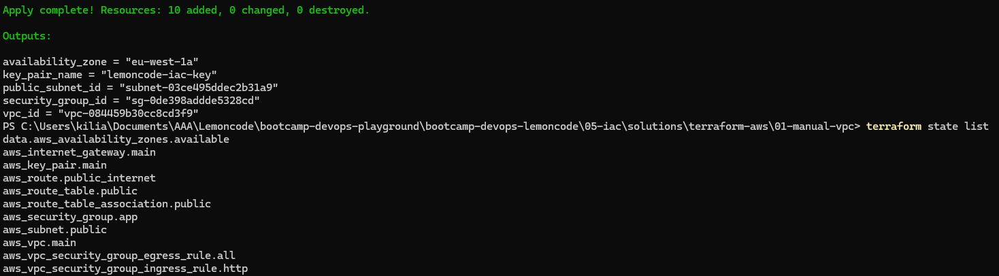

La captura demuestra que el apply manual de la Fase A terminó correctamente.

#### 02. VPC creada en AWS

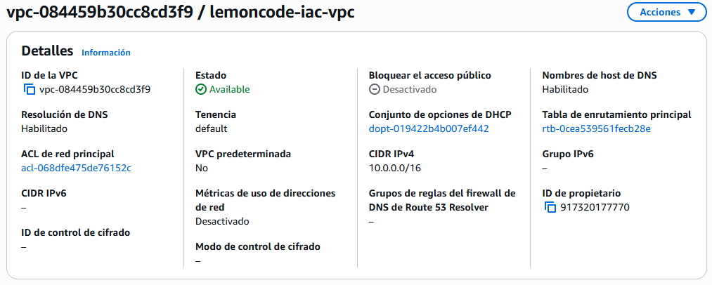

La captura demuestra que la VPC de la práctica existe en AWS.

#### 03. Subred pública y ruta al Internet Gateway

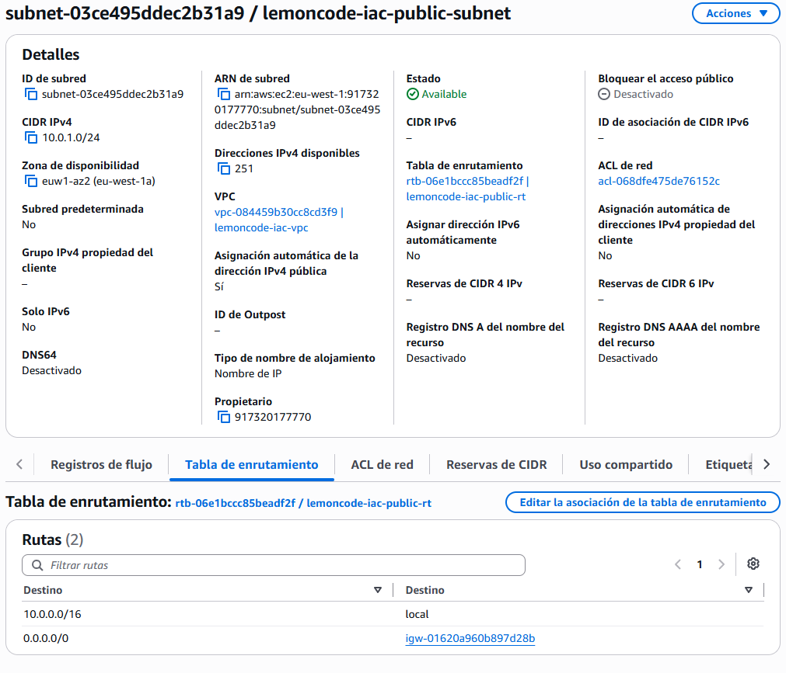

La captura demuestra la subred pública y su enrutamiento a través del IGW.

#### 04. Security group de la Fase A

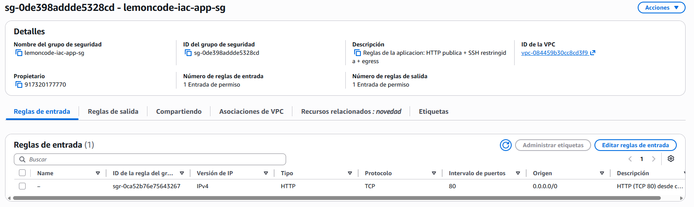

La captura demuestra HTTP expuesto y la ausencia de SSH globalmente abierto en la Fase A.

### Implementación manual — Fase B

#### 05. Apply de Terraform de la Fase B manual

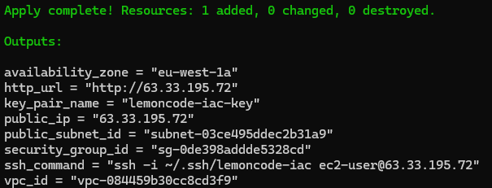

La captura demuestra que el apply de EC2 de la Fase B manual terminó correctamente.

#### 06. EC2 `t3.micro` en ejecución

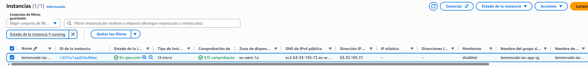

La captura demuestra que la instancia EC2 `t3.micro` estaba en ejecución en AWS.

#### 07. Docker y NGINX en ejecución en la EC2

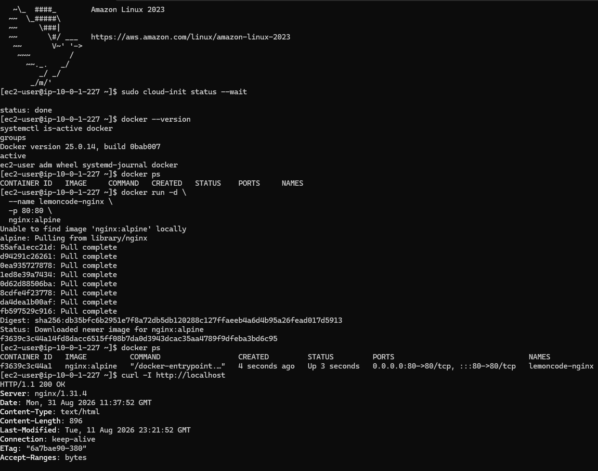

La captura demuestra que Docker ejecutaba NGINX y que el host EC2 recibía respuesta HTTP.

#### 08. NGINX accesible públicamente

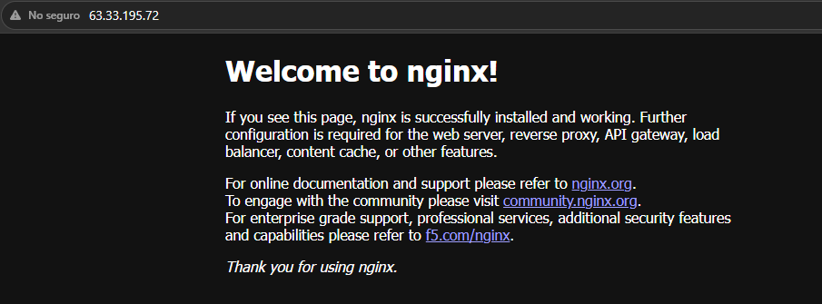

La captura demuestra que la página de bienvenida de NGINX era accesible desde un navegador.

#### 09. Security group de la Fase B

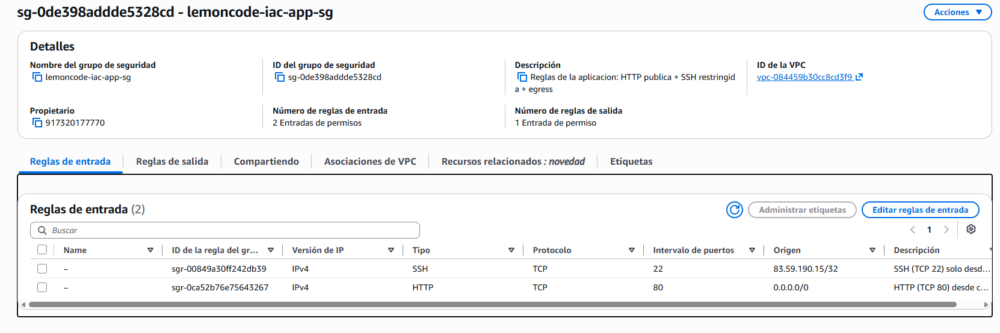

La captura demuestra SSH restringido a un `/32` y HTTP público.

### Limpieza manual

#### 10. Destrucción de la pila manual

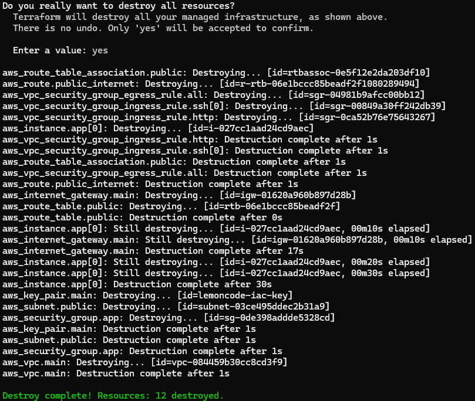

La captura demuestra que la pila manual completa fue destruida con Terraform.

### Refactor con VPC module — Fase A

#### 11. Apply de la Fase A con módulo VPC

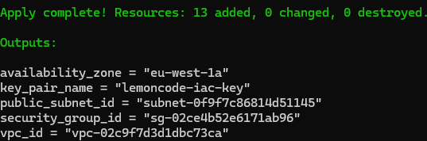

La captura demuestra que el apply de la Fase A basada en módulo terminó correctamente.

#### 12. Estado Terraform con recursos `module.vpc.*`

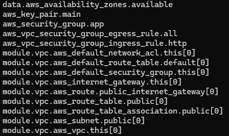

La captura demuestra que el refactor de red usa recursos gestionados por `terraform-aws-modules/vpc/aws`.

### Refactor con VPC module — Fase B

#### 13. Apply de EC2 de la Fase B con módulo

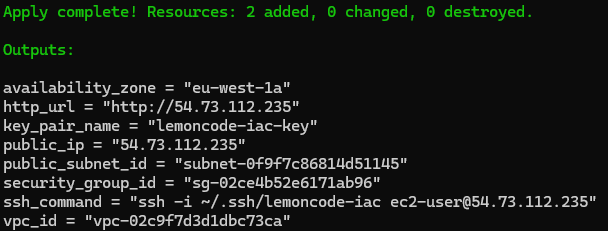

La captura demuestra que el apply de EC2 de la Fase B con módulo terminó correctamente.

#### 14. NGINX público con el despliegue refactorizado

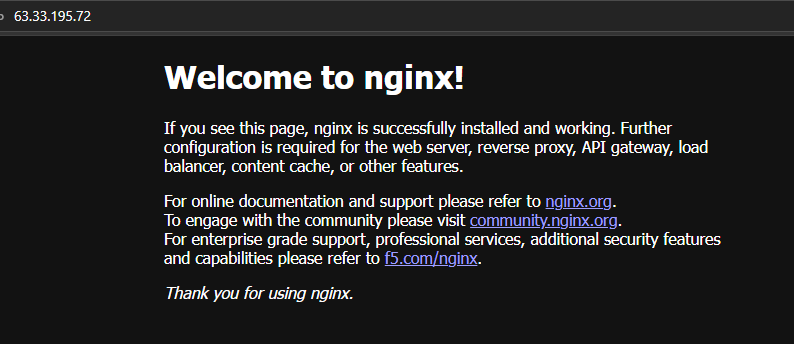

La captura demuestra que el despliegue basado en módulo también sirvió NGINX públicamente.

### Limpieza del módulo

#### 15. Destrucción de la pila basada en módulo

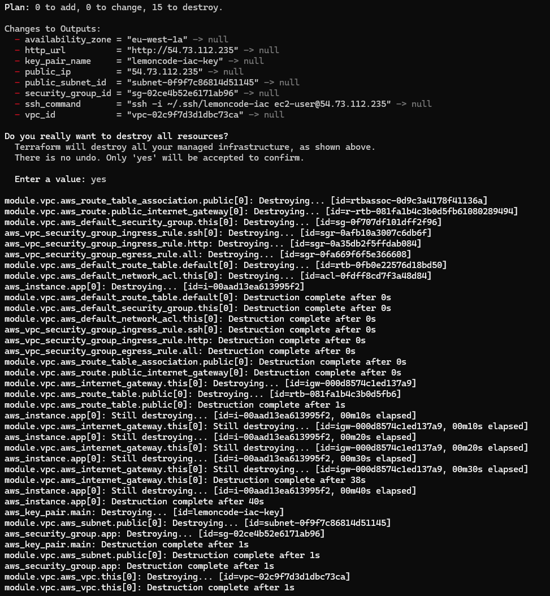

La captura demuestra que la pila completa basada en módulo fue destruida.

---

## Limpieza

Para repetir la limpieza en cualquiera de las dos variantes:

```bash
terraform destroy
terraform state list
```

En la validación real se ejecutó `terraform destroy` para ambas variantes: se eliminaron 12 recursos de la pila manual y 15 de la basada en módulo. Los waiters de AWS confirmaron la terminación de EC2 y la eliminación del volumen EBS. Comprobaciones posteriores no mostraron EC2 de entrenamiento activa, VPC de entrenamiento ni key pair `lemoncode-iac-key`, y `terraform state list` quedó vacío en ambos directorios.
